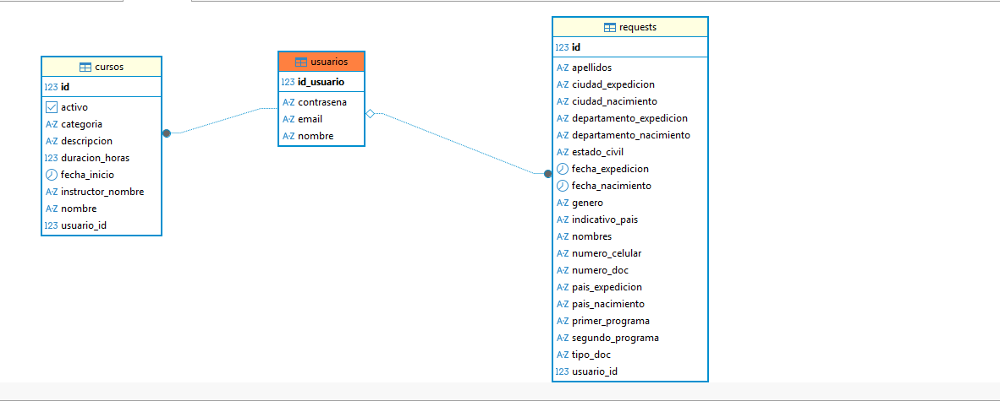

# Nexus

Plataforma universitaria para gestión de admisiones, oferta académica y matrículas.

## Introducción / Contexto

- **Descripción del problema:** Los procesos de inscripción y matrícula universitaria suelen estar fragmentados, generando procesos manuales lentos y falta de visibilidad para el aspirante sobre su estado de admisión.
- **Justificación:** La digitalización de estos flujos mejora la experiencia del estudiante, centraliza la información para la administración y permite un control eficiente del crecimiento institucional.
- **Dominio:** Gestión Académica y Procesos de Admisión Universitaria.

## Objetivos

**Objetivo General** Diseñar e implementar una plataforma web que permita gestionar de manera eficiente el proceso de inscripción, admisión y matrícula de estudiantes, facilitando la interacción entre aspirantes, estudiantes y personal administrativo.

**Objetivos Específicos** - Implementar un listado dinámico de carreras con visualización detallada de pensum y descripción.
- Desarrollar un módulo de inscripción que permita el registro de aspirantes y la persistencia de sus datos.
- Construir un panel administrativo para la gestión, aprobación y rechazo de solicitudes de ingreso.
- Habilitar un portal de estudiante para que los usuarios admitidos inicien sesión y gestionen su proceso de matrícula inicial.
- Establecer un sistema de autenticación y control de acceso basado en roles (Admin/Estudiante).

## Alcance del Proyecto (Scope)

**Qué se va a desarrollar:**
- **Módulo de Oferta Académica:** Visualización y gestión de la lista de carreras y cursos disponibles.
- **Sistema de Registro de Aspirantes:** Interfaz para que nuevos usuarios creen su perfil y carguen datos personales.
- **Módulo de Gestión de Solicitudes:** Funcionalidad para que el administrativo apruebe o rechace inscripciones.
- **Portal de Admisiones:** Panel de consulta de estado de trámite para el estudiante.

**Qué NO se va a desarrollar en esta versión (fuera de alcance):**
- Lógica de negocio para la generación automática de horarios o gestión de nómina de docentes.
- Integración con pasarelas de pago externas para el recaudo de matrículas.

## Tecnologías y Herramientas (Tech Stack)

- **Backend**: Spring Boot 3.4.1, Java 17, Spring Data JPA.
- **Frontend**: React 18 (Vite).
- **Base de datos**: PostgreSQL (Producción) y H2 (Desarrollo).
- **Otras herramientas**: Git, GitHub, Lombok, DBeaver, Maven.

## Integrantes del Equipo

| Nombre                  | Rol principal              | Usuario GitHub     |
|-------------------------|----------------------------|--------------------|
| David Quiroz Gonzalez   | Backend / Base de datos    | @Strikys12         |
| Ana Marcela Gallego     | UI Designer                | @Amgallego         |
| Miguel Angel Muñoz      | Frontend Lead              | @MiguelM1004       |
| Ana María Zapata        | Líder Frontend/Backend     | @AnamZapa          |

## Diagrama de Clases del Dominio (v1)

  
*Diagrama inicial del modelo de dominio – versión 1. Muestra la relación entre Usuarios, Cursos y Solicitudes (Requests).*

## Instrucciones de Instalación y Ejecución (para desarrolladores)

### 1. Clonar el repositorio

```bash
git clone https://github.com/Strikys12/sistema-admisiones-nexus-grupo2.git
```

### 2. Abrir el directorio
```bash
cd sistema-admisiones-nexus-grupo2
```


### 3. Configurar base de datos en ``src/main/resources/application-dev.properties``


**Configuración para PostgreSQL (Prisma Cloud):**

```properties
spring.datasource.url=jdbc:postgresql://db.prisma.io:5432/postgres?sslmode=require
spring.datasource.username=${DB_USER_NEXUS}
spring.datasource.password=${DB_PASSWORD_NEXUS}
spring.datasource.driver-class-name=org.postgresql.Driver

# Configuración de JPA / Hibernate
spring.jpa.hibernate.ddl-auto=update
spring.jpa.show-sql=true
```

**Configuración para H2 (Para pruebas rápidas):**

```properties
spring.datasource.url=jdbc:h2:mem:testdb
spring.datasource.driverClassName=org.h2.Driver
spring.datasource.username=sa
spring.datasource.password=
spring.jpa.database-platform=org.hibernate.dialect.H2Dialect
spring.h2.console.enabled=true
spring.jpa.hibernate.ddl-auto=update
```


### 4. Ejecutar la aplicación
**Desde linea de comandos:**
```bash
./mvnw spring-boot:run
```

**O desde IDE:**

Localizar la clase NexusApplication.java y ejecutarla como Java Application.

